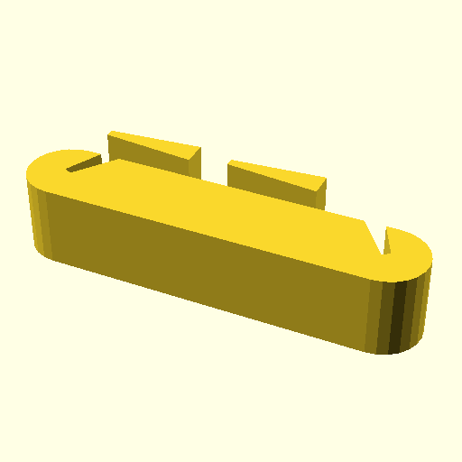

# Sanding Block

A sanding block inspired by [Sanding Block](https://www.thingiverse.com/thing:23863/),
designed by [Lochemage](https://www.thingiverse.com/lochemage/designs).
Customizable. The default is for small parts, which I often work on.

## Requirements

- openscad
- BSD make (optional, not GNU make)
- X server (optional)

## Usage

## Tips

PLA works fine. Infill 20%. Use brim when printing very small one. Print two,
sand one with another. 0.2 mm layer height is okay. I prefer 0.1 mm.

## Authors

- [Tomoyuki Sakurai](https://github.com/trombik)

## License

ISC. See [LICENSE](LICENSE).
